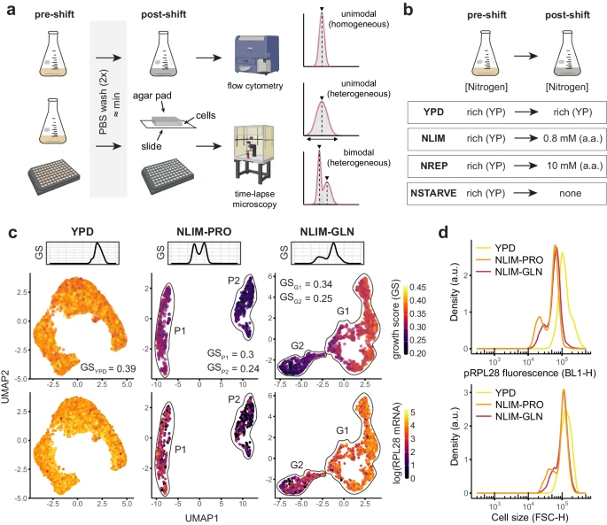
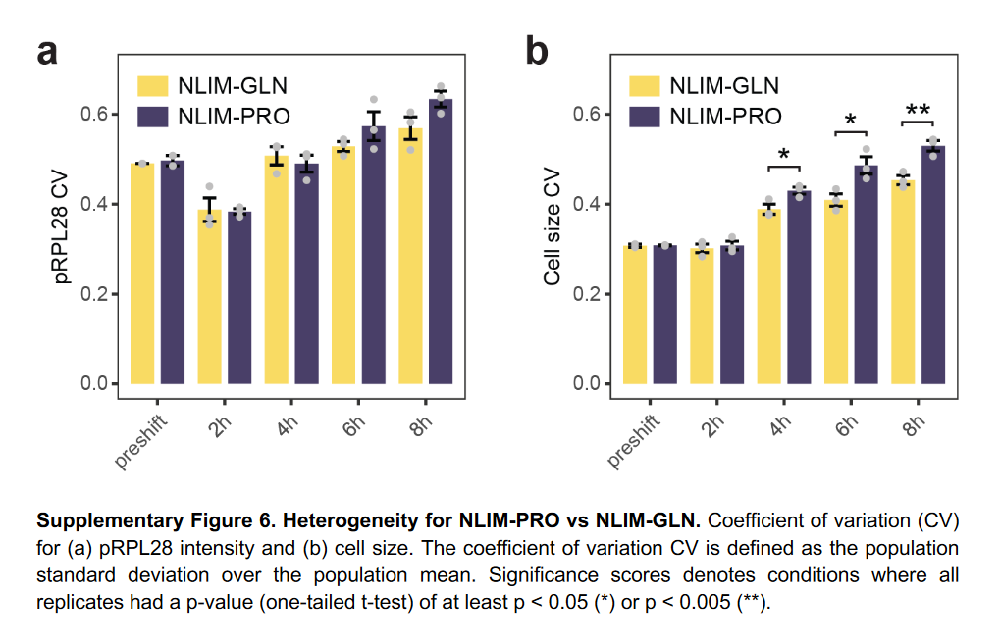
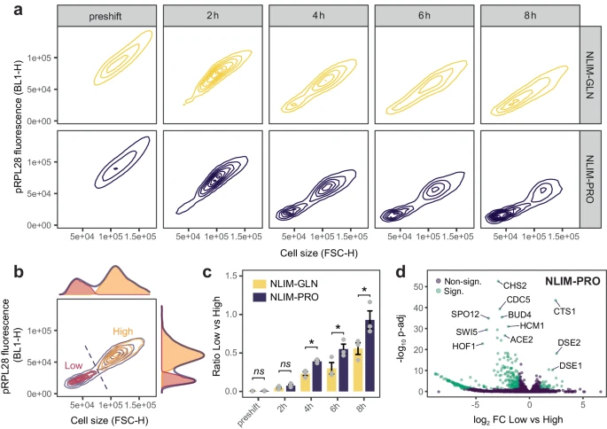
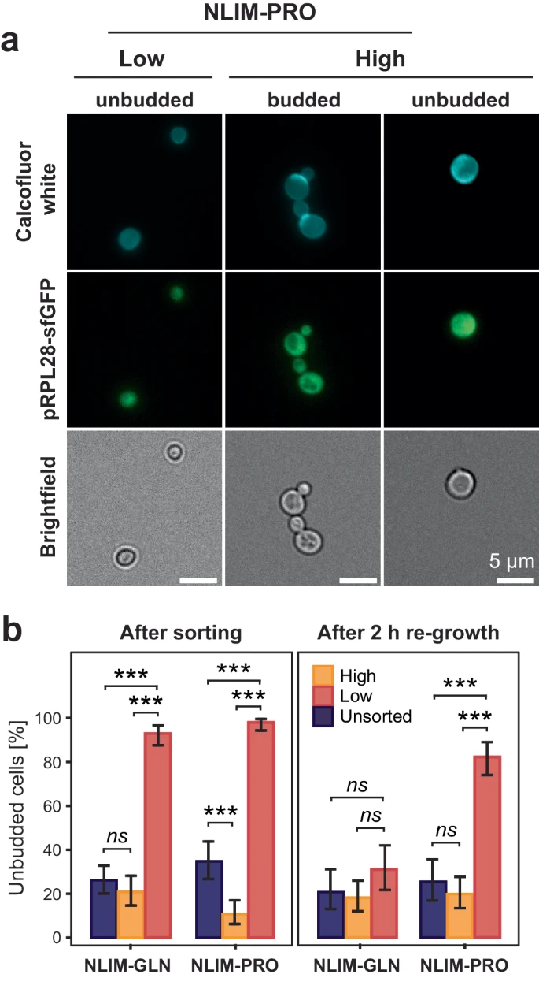
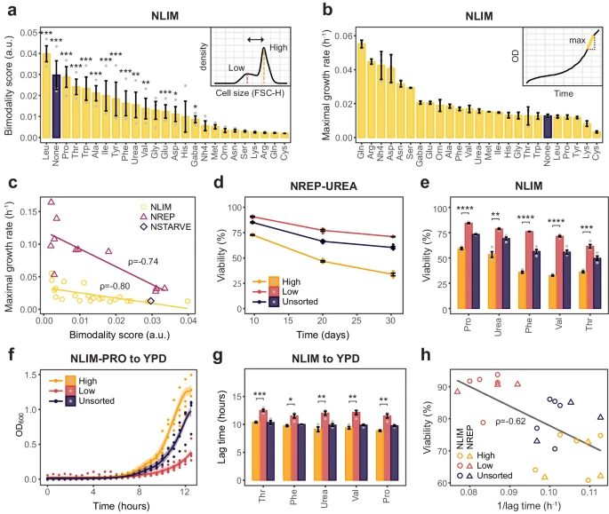

## Artigo

O artigo escolhido tem como título "[Phenotypic heterogeneity follows a growth-viability tradeoff in response to amino acid identity](https://www.nature.com/articles/s41467-024-50602-8#Sec9)", lê-se em português como "A heterogeneidade fenotípica segue um *trade-off* de capacidade de crescimento em resposta à identidade de aminoácidos". Foi publicado na revista [Nature](https://www.nature.com/) em 02 de Agosto de 2024.

### Introdução

Microrganismos passam a maior parte de sua vida em um estado quiescente, retomando o crescimento ao serem expostos a nutrientes. Quiescência e crescimento são estados celulares opostos, com perfis metabólicos e de expressão gênica distintos. As células quiescentes, menores e com paredes celulares mais espessas, focam em catabolismo para sobreviver ao estresse. A regulação do tamanho celular, taxa de crescimento e sobrevivência em resposta a sinais ambientais, como a falta de nutrientes, é um grande desafio. A heterogeneidade fenotípica dentro de populações geneticamente idênticas, causada por estocasticidade ou variações no ciclo celular, pode trazer vantagens adaptativas, como uma melhor alocação de recursos ou proteção contra investimentos em um único fenótipo. Avanços na fenotipagem de células únicas têm mostrado esse fenômeno, embora os processos subjacentes ainda sejam pouco compreendidos.

O estudo analisa a resposta de células de *Saccharomyces cerevisiae* a condições de crescimento com nitrogênio limitado, revelando subpopulações isogênicas quiescentes e em crescimento, com diferenças em tamanho, longevidade e capacidade de retomar o crescimento. Usando dados de RNA de célula e outros métodos, foi identificado que essas subpopulações apresentam especializações metabólicas baseadas nas fontes de nitrogênio. Foram identificadas duas subpopulações isogênicas com perfis transcriptômicos diferentes, onde o aminoácido prolina provocou uma diferenciação mais acentuada do que a glutamina. Uma subpopulação mostrou menor expressão de genes ribossomais e uma maior resposta ao estresse. A análise da fluorescência de RPL28 revelou que essas subpopulações também diferem no tamanho celular e no comportamento de crescimento. As subpopulações foram reversíveis, regenerando ambas as frações Low e High ao serem reexpostas a condições ricas.

O estudo demonstra que a heterogeneidade observada é fenotípica e não atribuída a diferenças genéticas, além de um comportamento conservado, dependente de aminoácidos, que influencia a dinâmica de populações.

### Metodologia

Os métodos apresentados no artigo, de uma maneira simplificada, foram:

1.  Sequenciamento de RNA de célula única (scRNAseq) para identificar subpopulações isogênicas;
2.  Análise de 24 fontes de nitrogênio com níveis limitados ou abundantes;
3.  Uso de biossensores metabólicos e uma biblioteca de fatores de transcrição marcados com GFP para estudar a resposta metabólica;
4.  Separação de subpopulações via citometria de fluxo e caracterização de seus perfis de crescimento e viabilidade.

### Resultados

Este estudo revela que *S. cerevisiae* exposta a uma redução de nitrogênio apresenta bimodalidade fenotípica, com subpopulações que equilibram entre longevidade e crescimento. As subpopulações possuem estados metabólicos diferentes, com uma otimizada para viabilidade e outra para crescimento. A bimodalidade é uma estratégia regulatória importante, e os aminoácidos podem servir como sinais ambientais para decisão celular. A leucina, por exemplo, pode indicar necessidade de dispersão e sobrevivência aumentada. As subpopulações quiescentes têm características que podem prolongar a viabilidade sem *esporulação\** e facilitar a dispersão via troca de metabólitos.

*\* processo pelo qual organismos, como fungos, bactérias e plantas, produzem esporos como forma de reprodução [1].*

Considerando o tema abordado no artigo e a disponibilização dos dados, o objetivo deste relatório é replicar as análises realizadas, utilizando métodos de inferência estatística por meio do software R. Pretende-se verificar se é possível chegar à resultados semelhantes e avaliar se esses resultados são consistentes com a teoria e a prática ensinadas na disciplina.

## Importando Bibliotecas

Bibliotecas são conjuntos de recursos que podem ser reutilizados em diferentes programas para realização de determinadas funções em comum. No presente trabalho, foram utilizadas as seguintes bibliotecas e ferramentas:

-   [**BiocManager**](https://bioconductor.github.io/BiocManager/articles/BiocManager.html)**:** Ferramenta para instalar e gerenciar pacotes do **Bioconductor**, uma coleção de pacotes para análise de dados de genomas e bioinformática no R.

-   [**readxl**](https://cran.r-project.org/web/packages/readxl/index.html)**:** Biblioteca para leitura de arquivos Excel no R.

-   [**tidyverse**](https://www.tidyverse.org/)**:** Um conjunto de bibliotecas no R para manipulação e visualização de dados, que inclui `ggplot2`, `dplyr`, `tidyr`, `readr`, `purrr`, entre outros.

-   [**scales**](https://scales.r-lib.org/)**:** Biblioteca para controle e personalização de escalas e eixos em gráficos no R.

-   [**flexmix**](https://cran.r-project.org/web/packages/flexmix/index.html)**:** Biblioteca para modelagem de mistura de modelos com diferentes distribuições.

-   [**mvtnorm**](https://cran.r-project.org/web/packages/mvtnorm/index.html)**:** Bibliote capara calcular distribuições e funções relacionadas com a distribuição normal multivariada.

```{r, message = FALSE}

bibliotecas = c(
  "BiocManager", 
  "tidyverse", 
  "scales",
  "flexmix",
  "mvtnorm",
  "gridExtra",
  "Rmixmod",
  "readxl"
)

for (biblioteca in bibliotecas) {
  if (!biblioteca %in% installed.packages()) {
    if (biblioteca == "BiocManager") {
      install.packages(biblioteca)
      BiocManager::install("SingleCellExperiment")
      next
    } 
    install.packages(biblioteca)
  }
}

library(ggplot2)
library(dplyr)
library(scales)
library(tidyverse)
library(flexmix)
library(mvtnorm)
library(gridExtra)
library(Rmixmod)
library(readxl)
```

## Importando dados

Todos os dados gerados ou analisados estão incluídos e disponibilizados no artigo e na seção de Informações Suplementares. O conteúdo do artigo está sob a licença Creative Commons Atribuição 4.0 Internacional, que permite o uso, compartilhamento, adaptação, distribuição e reprodução, desde que seja dado crédito ao autor original.

Dessa forma, foram baixados os arquivos fonte necessários para replicar as imagens que continham análises estatísticas que pudessem ser reproduzidas.

Uma prática comum ao trabalhar com análise de dados é a utilização de siglas para nomear as informações, o que facilita a manipulação e evita a escrita de nomes complexos (longos, com acentuação, etc.), que podem induzir a erros. No contexto deste relatório proveniente do artigo, as siglas utilizadas e seus significados estão listados abaixo:

-   GNL: Glutamina;

-   PRO: Prolina;

-   YPD: Extrato de levedura-peptonado-dextrose;

-   NLIM-PRO: Meios limitados de nitrogênio com Prolina;

-   NLIM-GLN: Meios limitados de nitrogênio com Glutamina.

```{r}

rm(list = ls())

PRO.preshift = read.csv(file = './data/source/fig2ab/1230_H9_pre_pRPL28_1.csv')
GLN.preshift = read.csv(file = './data/source//fig2ab/1230_H10_pre_pRPL28_2.csv')

PRO.2h = read.csv(file = './data/source/fig2ab/221121_1630_A1_PRO_GFP.csv')
GLN.2h = read.csv(file = './data/source/fig2ab/221121_1630_A2_GLN_GFP.csv')
PRO.4h = read.csv(file = './data/source/fig2ab/221121_1830_E1_PRO_GFP.csv')
GLN.4h = read.csv(file = './data/source/fig2ab/221121_1830_E2_GLN_GFP.csv')
PRO.6h = read.csv(file = './data/source/fig2ab/221121_2030_A1_PRO_GFP.csv')
GLN.6h = read.csv(file = './data/source/fig2ab/221121_2030_A2_GLN_GFP.csv')
PRO.8h = read.csv(file = './data/source/fig2ab/221121_2230_E1_PRO_GFP.csv')
GLN.8h = read.csv(file = './data/source/fig2ab/221121_2230_E2_GLN_GFP.csv')

PRO2.2h = read.csv(file = './data/source/fig2ab/1430_C2_pRPL28_NLIMPRO.csv')
GLN2.2h = read.csv(file = './data/source/fig2ab/1430_C3_pRPL28_NLIMGLN.csv')
PRO2.4h = read.csv(file = './data/source/fig2ab/1630_F2_pRPL28_NLIMPRO.csv')
GLN2.4h = read.csv(file = './data/source/fig2ab/1630_F3_pRPL28_NLIMGLN.csv')
PRO2.6h = read.csv(file = './data/source/fig2ab/1830_C2_pRPL28_NLIMPRO.csv')
GLN2.6h = read.csv(file = './data/source/fig2ab/1830_C3_pRPL28_NLIMGLN.csv')
PRO2.8h = read.csv(file = './data/source/fig2ab/2030_F2_pRPL28_NLIMPRO.csv')
GLN2.8h = read.csv(file = './data/source/fig2ab/2030_F3_pRPL28_NLIMGLN.csv')

PRO3.preshift = read.csv(file = './data/source/fig2ab/231012_preshift_1.csv')
GLN3.preshift = read.csv(file = './data/source/fig2ab/231012_preshift_2.csv')

PRO3.2h = read.csv(file = './data/source/fig2ab/231012_1440_NLIMPRO.csv')
GLN3.2h = read.csv(file = './data/source/fig2ab/231012_1440_NLIMGLN.csv')
PRO3.4h = read.csv(file = './data/source/fig2ab/231012_1640_NLIMPRO.csv')
GLN3.4h = read.csv(file = './data/source/fig2ab/231012_1640_NLIMGLN.csv')
PRO3.6h = read.csv(file = './data/source/fig2ab/231012_1840_NLIMPRO.csv')
GLN3.6h = read.csv(file = './data/source/fig2ab/231012_1840_NLIMGLN.csv')
PRO3.8h = read.csv(file = './data/source/fig2ab/231012_2040_NLIMPRO.csv')
GLN3.8h = read.csv(file = './data/source/fig2ab/231012_2040_NLIMGLN.csv')

YPD.1840 = read.csv(file = './data/source/fig1d/220707_1840_YPD.csv')
PRO.1830 = read.csv(file = './data/source/fig1d/221121_1830_E1_PRO_GFP.csv')
GLN.1830 = read.csv(file = './data/source/fig1d/221121_1830_E2_GLN_GFP.csv')
```

## Análise Exploratória

Uma análise exploratória é importante para entender os dados que serão utilizados e identificar formas para manipulá-los durante as análises. Abaixo, é apresentado um resumo dos conjuntos de dados importados até o momento, organizados em dataframes. Este resumo inclui o número de observações em cada um e o tipo de dado associado a cada coluna.

```{r}

nomesImportados = ls()

dataframesImportados = sapply(
  nomesImportados, 
  function(nome) is.data.frame(get(nome))
)

dataframesNomes = nomesImportados[dataframesImportados]

tiposDeDados = data.frame(
  cabeçalhos = names(PRO.2h), 
  tipos = sapply(PRO.2h, class), 
  stringsAsFactors = FALSE
)

tiposDeDados

numeroObservacoes = function(dataframeName) {
  dataframe = get(dataframeName)
  return(nrow(dataframe))
}

resumoObservacoes = data.frame(
  nome = dataframesNomes,
  observacoes = sapply(dataframesNomes, numeroObservacoes)
)

resumoObservacoes
```

### Mapeamento de dados

Uma das características do artigo foi a separação das observações com base na exposição das células, no tempo de ação e no padrão de replicação. O padrão de nomenclatura utilizado foi da mesma forma que o artigo original, onde "PRO3.preshift" pode ser interpretado como: "PRO" indicando um meio que contém prolina, "preshift" referindo-se ao tempo ou etapa preshift (pode ser ainda 2 horas, 4 horas, 6 horas ou 8 horas), e "3" como "replicação do tipo 3".

Os dados referentes aos diferentes meios e horários foram unidos em um único dataframe, com estrutura similar de uma tabela. Para classificar esses dados, foram adicionadas três novas colunas: *condition* (tipo de meio de exposição), *step* (tempo ou etapa de coleta da amostra) e *replicate* (padrão de replicação).

```{r}

condicoesPROGLN = c(
  rep('PRO', nrow(PRO.preshift)),
  rep('GLN', nrow(GLN.preshift)),
  rep('PRO', nrow(PRO.2h)),
  rep('GLN', nrow(GLN.2h)),
  rep('PRO', nrow(PRO.4h)),
  rep('GLN', nrow(GLN.4h)),
  rep('PRO', nrow(PRO.6h)),
  rep('GLN', nrow(GLN.6h)),
  rep('PRO', nrow(PRO.8h)),
  rep('GLN', nrow(GLN.8h)),
  rep('PRO', nrow(PRO2.2h)),
  rep('GLN', nrow(GLN2.2h)),
  rep('PRO', nrow(PRO2.4h)),
  rep('GLN', nrow(GLN2.4h)),
  rep('PRO', nrow(PRO2.6h)),
  rep('GLN', nrow(GLN2.6h)),
  rep('PRO', nrow(PRO2.8h)),
  rep('GLN', nrow(GLN2.8h)),
  rep('PRO', nrow(PRO3.preshift)),
  rep('GLN', nrow(GLN3.preshift)),
  rep('PRO', nrow(PRO3.2h)),
  rep('GLN', nrow(GLN3.2h)),
  rep('PRO', nrow(PRO3.4h)),
  rep('GLN', nrow(GLN3.4h)),
  rep('PRO', nrow(PRO3.6h)),
  rep('GLN', nrow(GLN3.6h)),
  rep('PRO', nrow(PRO3.8h)),
  rep('GLN', nrow(GLN3.8h))
)

etapaPROGLN = c(
  rep('preshift', nrow(PRO.preshift)),
  rep('preshift', nrow(GLN.preshift)),
  rep('2h', nrow(PRO.2h)),
  rep('2h', nrow(GLN.2h)),
  rep('4h', nrow(PRO.4h)),
  rep('4h', nrow(GLN.4h)),
  rep('6h', nrow(PRO.6h)),
  rep('6h', nrow(GLN.6h)),
  rep('8h', nrow(PRO.8h)),
  rep('8h', nrow(GLN.8h)),
  rep('2h', nrow(PRO2.2h)),
  rep('2h', nrow(GLN2.2h)),
  rep('4h', nrow(PRO2.4h)),
  rep('4h', nrow(GLN2.4h)),
  rep('6h', nrow(PRO2.6h)),
  rep('6h', nrow(GLN2.6h)),
  rep('8h', nrow(PRO2.8h)),
  rep('8h', nrow(GLN2.8h)),
  rep('preshift', nrow(PRO3.preshift)),
  rep('preshift', nrow(GLN3.preshift)),
  rep('2h', nrow(PRO3.2h)),
  rep('2h', nrow(GLN3.2h)),
  rep('4h', nrow(PRO3.4h)),
  rep('4h', nrow(GLN3.4h)),
  rep('6h', nrow(PRO3.6h)),
  rep('6h', nrow(GLN3.6h)),
  rep('8h', nrow(PRO3.8h)),
  rep('8h', nrow(GLN3.8h))
)

replicacaoPROGLN = c(
  rep('rep1', nrow(PRO.preshift)),
  rep('rep1', nrow(GLN.preshift)),
  rep('rep1', nrow(PRO.2h)),
  rep('rep1', nrow(GLN.2h)),
  rep('rep1', nrow(PRO.4h)),
  rep('rep1', nrow(GLN.4h)),
  rep('rep1', nrow(PRO.6h)),
  rep('rep1', nrow(GLN.6h)),
  rep('rep1', nrow(PRO.8h)),
  rep('rep1', nrow(GLN.8h)),
  rep('rep2', nrow(PRO2.2h)),
  rep('rep2', nrow(GLN2.2h)),
  rep('rep2', nrow(PRO2.4h)),
  rep('rep2', nrow(GLN2.4h)),
  rep('rep2', nrow(PRO2.6h)),
  rep('rep2', nrow(GLN2.6h)),
  rep('rep2', nrow(PRO2.8h)),
  rep('rep2', nrow(GLN2.8h)),
  rep('rep3', nrow(PRO3.preshift)),
  rep('rep3', nrow(GLN3.preshift)),
  rep('rep3', nrow(PRO3.2h)),
  rep('rep3', nrow(GLN3.2h)),
  rep('rep3', nrow(PRO3.4h)),
  rep('rep3', nrow(GLN3.4h)),
  rep('rep3', nrow(PRO3.6h)),
  rep('rep3', nrow(GLN3.6h)),
  rep('rep3', nrow(PRO3.8h)),
  rep('rep3', nrow(GLN3.8h))
)


dadosPROGLN = bind_rows(
  PRO.preshift, 
  GLN.preshift, 
  PRO.2h, 
  GLN.2h, 
  PRO.4h, 
  GLN.4h, 
  PRO.6h, 
  GLN.6h, 
  PRO.8h, 
  GLN.8h,
  PRO2.2h, 
  GLN2.2h, 
  PRO2.4h, 
  GLN2.4h, 
  PRO2.6h, 
  GLN2.6h, 
  PRO2.8h, 
  GLN2.8h,
  PRO3.preshift, 
  GLN3.preshift, 
  PRO3.2h, 
  GLN3.2h, 
  PRO3.4h, 
  GLN3.4h, 
  PRO3.6h, 
  GLN3.6h, 
  PRO3.8h, 
  GLN3.8h
)

dadosPROGLN$conditions = condicoesPROGLN
dadosPROGLN$step = etapaPROGLN
dadosPROGLN$replicate = replicacaoPROGLN

head(dadosPROGLN)
```

Para as análises iniciais, algumas informações foram reutilizadas, geralmente relacionadas a estatísticas como média, desvio padrão e erro padrão do tamanho, fluorescência das células e seus respectivos coeficientes de variação.

```{r}

sumarioPROGLN = dadosPROGLN %>%
  group_by(
    conditions,
    step,
    replicate
  ) %>%
  summarize(
    mean_pRPL28 = mean(BL1.H),
    sd_pRPL28 = sd(BL1.H),
    cv_pRPL28 = sd_pRPL28/mean_pRPL28,
    
    mean_size = mean(FSC.H),
    sd_size = sd(FSC.H),
    cv_size = sd_size/mean_size,
    
    .groups = "keep"
  )

head(sumarioPROGLN)


estatisticasPROGLN = sumarioPROGLN %>%
  group_by(step, conditions) %>%
  summarize(
    mean_mean_pRPL28 = mean(mean_pRPL28),
    mean_sd_pRPL28 = mean(sd_pRPL28),
    mean_cv_pRPL28 = mean(cv_pRPL28),
    
    se_mean_pRPL28 = sd(mean_pRPL28)/ sqrt(n()),
    se_sd_pRPL28 = sd(sd_pRPL28)/ sqrt(n()),
    se_cv_pRPL28 = sd(cv_pRPL28)/ sqrt(n()),
    
    mean_mean_size = mean(mean_size),
    mean_sd_size = mean(sd_size),
    mean_cv_size = mean(cv_size),
    
    se_mean_size = sd(mean_size)/ sqrt(n()),
    se_sd_size = sd(sd_size)/ sqrt(n()),
    se_cv_size = sd(cv_size)/ sqrt(n()),
    
    .groups = "keep"
  )

head(estatisticasPROGLN)
```

### Figura 01

Nesta etapa da análise, o objetivo era examinar a distribuição da densidade de probabilidade da fluorescência de pRPL28 e tamanho das células e verificar se, conforme sugerido pelos dados de scRNA-seq, a bimodalidade pode ser detectada em meios limitados de nitrogênio contendo prolina ou glutamina, mas não em meios ricos, como o extrato de levedura-peptonado-dextrose.



#### **1a (**Distribuição de densidade de probabilidade**)**

Como elencado na Figura 1a, existem três tipos de distribuição de densidade de probabilidade a serem consideradas neste estudo:

1.  Unimodal Heterogênea: apresenta um único pico no gráfico, mas a fluorescência ou tamanho variam entre as células;

2.  Unimodal Homogênea: também há um único pico, mas a fluorescência ou tamanho entre as células são uniformes entre as células, ou seja, a variação é pequena;

3.  Bimodal Heterogênea: exibe dois picos no gráfico, refletindo duas populações de células com características diferentes de fluorescência ou tamanho, com variação não uniforme.

#### 1d (Análise de Bimodalidade)

A Figura 1D analisa a heterogenidade fenotípica de células de levedura expostas a redução de nitrogênio. O tamanho celular foi medido através de uma técnica de dispersão da luz (nomeada FSC-H).

Foram analisadas três condições diferentes: YPD (meio rico em nutrientes), NLIM-PRO (meio com limitação de prolina) e NLIM-GLN (meio com limitação de glutamina).

Os resultados demonstram que as células YPD possuem uma distribuição de tamanhos mais unifome, enquanto NLIM-PRO e NLIM-GLN diversificaram mais de tamanho. A interpretação feita é de que em condições onde os nutrientes são limitados, as células podem adotar estratégias diferentes, como reduzir seu tamanho para reduzir a atividade metabólica e poupar recursos.

```{r}

condicoesBimodalidade = c(
  rep('YPD', nrow(YPD.1840)),
  rep('NLIM-PRO', nrow(PRO.1830)),
  rep('NLIM-GLN', nrow(GLN.1830))
)

bimodalidade = bind_rows(YPD.1840, PRO.1830, GLN.1830)
bimodalidade$conditions = condicoesBimodalidade

valorMin = min(c(bimodalidade$BL1.H, bimodalidade$FSC.H), na.rm = TRUE)
valorMax = max(c(bimodalidade$BL1.H, bimodalidade$FSC.H), na.rm = TRUE)

gerarGraficoBimodalidade = function(valorX, legendaX) {
  grafico = ggplot(
    bimodalidade, 
    aes(x = valorX, colour = conditions)
  ) + 
  geom_density(linewidth = 1) +
  scale_x_log10(
    breaks = trans_breaks("log10", function(x) 10 ^ x),
    labels = trans_format("log10", math_format(10 ^ .x)),
    limits = c(valorMin, valorMax)
  ) +
  theme_bw(
    base_size = 10
  ) +
  labs(
    colour = "Condições",
    x = legendaX,
    y = "Densidade (a.u.)"
  )
  
  return(grafico)
}

fluorescencia = gerarGraficoBimodalidade(
  valorX = bimodalidade$BL1.H, 
  legendaX = "pRPL28 fluorescência (BL1-H)"
)

tamanhoCelula = gerarGraficoBimodalidade(
  valorX = bimodalidade$FSC.H, 
  legendaX = "Tamanho da célula (FSC-H)"
)

grid.arrange(fluorescencia, tamanhoCelula, ncol = 1)
```

### Figura Suplementar 6

A figura suplementar 6 se trata do Coeficiente de Variação, que é uma medida para expressar a variabilidade de uma variável em relação à sua média.



Por meio coeficiente de variação (CV) pode-se fazer uma comparação de heterogeneidade entre as duas condições, NLIM-GLN e NLIM-PRO, ao longo das diferentes etapas de tempo. Dos gráficos apresentados, tem-se que a variabilidade no NLIM-PRO é maior do que no NLIM-GLN na maior parte das etapas e para ambos os parâmetros analisados, indicando que as células NLIM-PRO são mais heterogêneas na expressão de pRPL28 e também em seu tamanho.

```{r}

variabilidadeTamanho = ggplot(
  estatisticasPROGLN, 
  aes(
    x = step, 
    y = mean_cv_size, 
    fill = conditions
  )
) +
    geom_bar(
      stat = "identity",
      position = position_dodge(width = 0.9),
      width = 0.7
    ) +
    geom_point(
      data = sumarioPROGLN, 
      aes(
        x = step, 
        y = cv_size, 
        group = conditions
      ), 
      position = position_dodge(width = 0.9),
      size = 0.8,
      color = "gray"
    ) +
    geom_errorbar(
      aes(
        ymin = mean_cv_size - se_cv_size,
        ymax = mean_cv_size + se_cv_size
      ),
      position = position_dodge(width = 0.9),
      width = 0.4
    ) +
    ylim(0, 0.7) +
    theme_bw(
      base_size = 9
    ) +
    labs(
      fill = "Condições",
      y = "Coef. Variação (Tamanho)",
      x = "Tempo"
    )


variabilidadeFlorescencia = ggplot(
  estatisticasPROGLN, 
  aes(
    x = step, 
    y = mean_cv_pRPL28, 
    fill = conditions
  )
) +
    geom_bar(
      stat = "identity",
      position = position_dodge(width = 0.9),
      width = 0.7
    ) +
    geom_point(
      data = sumarioPROGLN, 
      aes(
        x = step, 
        y = cv_pRPL28, 
        group = conditions
      ), 
      position = position_dodge(width = 0.9), 
      size = 0.8,
      color = "gray"
    ) +
    geom_errorbar(
      aes(
        ymin = mean_cv_pRPL28 - se_cv_pRPL28,
        ymax = mean_cv_pRPL28 + se_cv_pRPL28
      ),
      position = position_dodge(width = 0.9),
      width = 0.4
    ) +
    ylim(0, 0.7) +
    theme_bw(
      base_size = 9
    ) +
    labs(
      fill = "Condições",
      y = "Coef. Variação (Flourescência)",
      x = "Tempo"
    )


grid.arrange(
  variabilidadeFlorescencia, 
  variabilidadeTamanho, 
  ncol = 1
)
```

Os dados replicados se mostaram consistentes com os do artigo, mantendo a mesma proporção e valores obtidos. Além dos gráficos, o estudo aplicou a ferramenta do teste t, que é técnica utilizada para comparar as médias de dois grupos e determinar se há uma diferença significativa entre elas.

Nessa etapa, foi realizado um teste t não pareado, em que:

-   **Hipótese Nula (H₀):** Não há diferença significativa no tamanho médio das células entre os meios limitados de nitrogênio com prolina e glutamina após 8 horas de cultivo.

-   **Hipótese Alternativa (H₁):** Há uma diferença significativa no tamanho médio das células entre os meios limitados de nitrogênio com prolina e glutamina após 8 horas de cultivo.

Entretanto, é importante lembrar que uma das premissas para a aplicação do teste T é a normalidade dos dados. Para verificar se os dados seguem uma distribuição normal, pode-se realizar o teste de Shapiro-Wilk. Neste teste, a hipótese nula (H₀) é de que os dados são de uma distribuição normal.

```{r}

PRO8H = sumarioPROGLN %>%
  filter(step == "8h" & conditions =="PRO") %>% pull(cv_size)

GLN8H = sumarioPROGLN %>%
  filter(step == "8h" & conditions =="GLN") %>% pull(cv_size)

shapiro.test(PRO8H)
shapiro.test(GLN8H)
```

Como o p-valor obtido foi maior que o nível de significância padrão de 5%, não há evidências suficientes para rejeitar a hipótese nula, sugerindo que os dados podem ser considerados como de uma distribuição normal, e pode-se aplicar o teste T.

```{r}

t.test(PRO8H, GLN8H, paired = FALSE, alternative = "two.sided")
```

De acordo com os resultados do teste, a hipótese nula foi rejeitada, pois o p-valor obtido foi menor que o nível de significância padrão de 5%. Isso indica que há uma diferença significativa no tamanho médio das células entre os meios limitados de nitrogênio com prolina e glutamina após 8 horas de cultivo.

### Figura 02

Nessa etapa da análise, as células foram agrupadas com base em duas características principais: o tamanho da célula e a fluorescência de pRPL28, isso para identificar diferentes subpopulações dentro da amostra de células. Este processo é denominado de *clustering* multivariado, em que há a combinação de múltiplas variáveis para encontrar agrupamentos nos dados. Como o conceito não foi abordado no escopo da disciplina, a função necessária para realizar essa classificação foi extraída do código fonte disponibilizado no artigo.



```{r}

flexmixMVClustering = function(
    dados, 
    limiarProbabilidade=0.95, 
    dimensoes=c("FSC.H", "BL1.H"),
    numeroClusters=2,
    clusterInicial=NULL
){
  # Realiza o clustering multivariado
  # dados : data frame com dados de fluxo
  # limiarProbabilidade : valor para o limiar para atribuir células ao cluster 
  # dimensoes : dimensões para realizar o clustering 
  
  modelo1 = FLXMCmvnorm()
  modelo2 = FLXMCmvnorm()
  
  dadosMVFit = dados %>% 
    dplyr::select(all_of(dimensoes))
  
  set.seed(123)
  
  if (is.null(clusterInicial)) {
    ajusteFlex = flexmix(
      as.matrix(dadosMVFit) ~ 1, 
      data = dadosMVFit, 
      k = numeroClusters, 
      model = list(modelo1, modelo2)
    )
  } else {
    ajusteFlex = flexmix(
      as.matrix(dadosMVFit) ~ 1, 
      data = dadosMVFit, 
      k = numeroClusters, 
      model = list(modelo1, modelo2), 
      cluster = clusterInicial
    )
  }
  
  probabilidades = posterior(ajusteFlex)
  dadosClusterizados = cbind(dados, probabilidades)
  
  parametrosCluster1 = parameters(ajusteFlex, component=1)[[1]]
  parametrosCluster2 = parameters(ajusteFlex, component=2)[[1]]
  
  mediasClusters = c(
    parameters(ajusteFlex, component=1)[[1]][1],
    parameters(ajusteFlex, component=2)[[1]][1]
  )
  
  if (which.min(mediasClusters) == 1) {
    dadosClusterizados = dplyr::rename(
      dadosClusterizados, "lowProb" = "1"
    )
    dadosClusterizados = dplyr::rename(
      dadosClusterizados, "highProb" = "2"
    )
  } else {
    dadosClusterizados = dplyr::rename(
      dadosClusterizados, "lowProb" = "2"
    )
    dadosClusterizados = dplyr::rename(
      dadosClusterizados, "highProb" = "1"
    )
  }
  
  dadosClusterizados = dadosClusterizados %>% 
    mutate(
      class = if_else(
        lowProb > limiarProbabilidade, 
        "Low", 
        if_else(
          highProb > limiarProbabilidade , "High", "Unknown"
        )
      )
    )
  
  dadosClusterizados
}
```

Assim como um modelo de regressão simples pode ser usado para expressar a relação linear entre duas variáveis, o Modelo de Mistura Gaussiana é utilizado na análise de clusters em dados multivariados. Nesse modelo, assume-se que os dados são gerados a partir de uma combinação de várias distribuições normais multivariadas. Como esse tópico não foi abordado na disciplina, utilizamos como base o código fonte do artigo, que utiliza a função `FLXMCmvnorm()` para criar um modelo gaussiano/multivariado com o pacote `flexmix`.

No modelo multivariado, a divisão entre Low e High foi realizada com base na classificação das células de acordo com dois parâmetros: flourescência e tamanho. As células foram separadas em dois grupos distintos (representados pelos picos das distribuições na figura 1d):

-   **Low**: Células com tamanho abaixo da reta de separação.
-   **High**: Células com tamanho acima da reta de separação.

O objetivo é analisar a taxa de células Low em relação às células High em diferentes pontos de tempo e condições. Além disso, são calculados os intervalos de confiança para essas proporções.

```{r, warning = FALSE}

modelo1 = FLXMCmvnorm()
modelo2 = FLXMCmvnorm()

dadosMultivariados = dadosPROGLN %>%
  filter(step == "4h" & conditions == "PRO" & replicate == "rep1") %>%
  dplyr::select(all_of(c("FSC.H", "BL1.H")))

set.seed(123)

ajusteModelo = flexmix(
  as.matrix(dadosMultivariados) ~ 1,
  data = dadosMultivariados,
  k = 2,
  model = list(modelo1, modelo2)
)

paramsModelo1 = parameters(ajusteModelo, component=1)[[1]]
paramsModelo2 = parameters(ajusteModelo, component=2)[[1]]

modelo1Limites = c(paramsModelo1[1], paramsModelo1[2])
Modelo2Limites = c(paramsModelo2[1], paramsModelo2[2])
 
coeficienteVariacao = (
  Modelo2Limites[2] - modelo1Limites[2]
  )/(
    Modelo2Limites[1] - Modelo2Limites[1]
  )

dadosClusterizadosPROGLN = flexmixMVClustering(
  dadosPROGLN %>%
    filter(step=="4h" & conditions=="PRO" & replicate=="rep1")
)

mediasdadoSemClassificacao = dadosClusterizadosPROGLN %>%
  filter(class == "Unknown") %>%
  summarise(across(c(FSC.H, BL1.H), mean))

pontoMedio = c(
  mediasdadoSemClassificacao$FSC.H, 
  mediasdadoSemClassificacao$BL1.H
)

coeficienteVariacaoInverso = - 1 / coeficienteVariacao

intercepto = pontoMedio[2] - coeficienteVariacaoInverso * pontoMedio[1]

divisaoDados = dadosPROGLN %>%
  mutate(
    hard_assign = ifelse(
      BL1.H < coeficienteVariacaoInverso * FSC.H + intercepto, "Low", "High"
    )
  )

taxaDivisaoDados = divisaoDados %>%
  dplyr::select(c("conditions", "step", "replicate", "hard_assign")) %>%
  group_by(conditions, step, replicate) %>%
  summarize(
    count_high = sum(hard_assign == "High"),
    count_low = sum(hard_assign == "Low"),
    .groups = "keep"
  ) %>%
  mutate(
    ratio_low_to_high = count_low / count_high
  )

mapeamentoHoras = c("2h" = 2, "4h" = 4, "6h" = 6, "8h" = 8,  "preshift" = 0)
ordenamentoHoras = c("preshift", "2h", "4h", "6h", "8h")

taxaDivisaoDados$numeric_time = mapeamentoHoras[
  as.character(taxaDivisaoDados$step)
]

taxaDivisaoDados$step = factor(taxaDivisaoDados$step, levels = ordenamentoHoras)
 
mediaTaxas = taxaDivisaoDados %>%
  group_by(step, conditions) %>%
  summarize(
    mean_ratio = mean(ratio_low_to_high),
    sd_ratio = sd(ratio_low_to_high) / sqrt(n()),
    .groups = "keep"
  )

ggplot(
  mediaTaxas,
  aes(x = step, y = mean_ratio, fill = conditions)
) +
  geom_bar(
    stat = "identity",
    position = position_dodge(width = 0.9),
    width = 0.7
  ) +
  geom_errorbar(
    aes(
      ymin = mean_ratio - sd_ratio, 
      ymax = mean_ratio + sd_ratio
    ),
    position = position_dodge(width = 0.9),
    width = 0.4
  ) +
  geom_point(
    data = taxaDivisaoDados,
    aes(
      x = step, 
      y = ratio_low_to_high, 
      group = conditions
    ),
    position = position_dodge(width = 0.9),
    size = 0.8,
    colour="grey"
  ) +
  ylim(0, 2) +
  theme_bw(base_size = 8) +
  labs(
    fill = "Condições",
    y = "Razão Low para High",
    x = "Tempo"
  )
```

Os dados replicados seguem a mesma proporção, mas apresentam valores pouco diferentes dos mostrados no artigo. Um ponto a ser destacado é que o ponto médio foi calculado diretamente a partir dos dados obtidos, sem arredondamento, ao contrário do artigo, onde os valores parecem ter sido inseridos manualmente no código. Essa diferença pode ter contribuído para as pequenas variações observadas, embora seja apenas uma hipótese, podem ter outros fatores não observados até então.

No teste t aplicado para razão Low para High temos as seguintes hipóteses:

-   **Hipótese Nula (H₀):** Não há diferença significativa entre as razões Low para High nas condições PRO e GLN no tempo de 4 horas;

-   **Hipótese Alternativa (H₁):** Existe uma diferença significativa entre as razões Low para High nas condições PRO e GLN no tempo de 4 horas.

```{r}

PRO4H = taxaDivisaoDados %>%
  filter(step == "4h" & conditions =="PRO") %>% 
  pull(ratio_low_to_high)

GLN4H = taxaDivisaoDados %>% 
  filter(step == "4h" & conditions =="GLN") %>%
  pull(ratio_low_to_high)

t.test(PRO4H, GLN4H, paired = FALSE, alternative = "two.sided")
```

Como o p-valor é menor comparado a um nível de significância de 5%, pode-se rejeitar a hipótese nula, logo há evidências para dizer que existe uma diferença significativa entre as razões "Low" para "High" nas condições PRO e GLN no tempo de 4 horas.

### Figura 03

A figura mostra a fração de células sem brotos em diferentes subpopulações de levedura, em condições diferentes: com limitação de glutamina (NLIM_GLN) e prolina (NLIM-PRO). As subpopulações são: "unsorted" (não classificadas), "low" (com baixa expressão fenotípica) e "high" (com alta expressão fenotípica).

{style="width: 40%"}

```{r}

caminhoArquivo = './data/source/fig3b/budscarquant.xlsx' 
dados = read_excel(caminhoArquivo, sheet="budscar quantificatio")

View(dados)

percentualSemCicatrizes = as.numeric(dados$`...6`[4:9])  
totalCelulas = as.numeric(dados$`...5`[4:9])        

percentualSemCicatrizes = percentualSemCicatrizes[!is.na(percentualSemCicatrizes)]
totalCelulas = totalCelulas[!is.na(totalCelulas)]

calcularIntervaloConfianca = function(p, n, z = 1.96) {
  erroPadrao = sqrt((p * (1 - p)) / n)
  intervaloInferior = p - z * erroPadrao
  intervaloSuperior = p + z * erroPadrao
  return(c(intervaloInferior * 100, intervaloSuperior * 100))  
}

intervalosConfiancaRecalculados = t(
  sapply(
    1:length(percentualSemCicatrizes), 
    function(i) calcularIntervaloConfianca(
      percentualSemCicatrizes[i] / 100,  totalCelulas[i]
    )
  )
)

dfIntervalosConfiancaRecalculados = data.frame(
  PercentualSemCicatrizes = percentualSemCicatrizes,
  TotalCelulas = totalCelulas,
  IntervaloInferiorRecalculado = intervalosConfiancaRecalculados[, 1],
  IntervaloSuperiorRecalculado = intervalosConfiancaRecalculados[, 2]
)

print("Intervalos de Confiança:")
print(dfIntervalosConfiancaRecalculados)

validarDados = function(vetor) {
  all(!is.na(vetor) & is.finite(vetor) & vetor >= 0)
}

valoresP = c()
for (i in seq(1, length(percentualSemCicatrizes), 3)) {
  matrizBaixoAlto = matrix(
    c(
      dados$`...3`[3 + i], dados$`...4`[3 + i], # Baixo
      dados$`...3`[5 + i], dados$`...4`[5 + i]  # Alto
    ),
    nrow = 2
  )
  
  if (validarDados(as.vector(matrizBaixoAlto))) {
    valorPBaixoAlto = fisher.test(matrizBaixoAlto)$p.value
  } else {
    valorPBaixoAlto = NA
    message("Dados inválidos para Baixo vs. Alto na iteração ", i)
  }
  
  valoresP = c(valoresP, valorPBaixoAlto)
  
  matrizMisturadoBaixo = matrix(
    c(
      dados$`...3`[3 + i], dados$`...4`[3 + i],  # Misturado
      dados$`...3`[4 + i], dados$`...4`[4 + i]   # Baixo
    ), 
    nrow = 2
  )
  
  if (validarDados(as.vector(matrizMisturadoBaixo))) {
    valorPMisturadoBaixo = fisher.test(matrizMisturadoBaixo)$p.value
  } else {
    valorPMisturadoBaixo = NA
    message("Dados inválidos para Misturado vs. Baixo na iteração ", i)
  }
  valoresP = c(valoresP, valorPMisturadoBaixo)
}

print("P-valores calculados usando o teste de Fisher:")
print(valoresP)

dadosFiltrados = data.frame(
  Condicao = rep(
    c('NLIM-GLN', 'NLIM-GLN', 'NLIM-GLN', 'NLIM-PRO', 'NLIM-PRO', 'NLIM-PRO'), 
    2
  ),
  TempoRegresso = rep(
    c(
      'Após triagem', 'Após triagem', 'Após triagem', 'Após triagem', 
      'Após triagem', 'Após triagem', 'Após 2h de crescimento', 
      'Após 2h de crescimento', 'Após 2h de crescimento', 
      'Após 2h de crescimento', 'Após 2h de crescimento', 
      'Após 2h de crescimento'
    )
  ),
  Populacao = rep(c('Não triado', 'Baixo', 'Alto'), 4),
  PercentualSemBrotos = c(
    26.1, 79.2, 31.0, 22.0, 91.0, 27.5, 25.3, 28.4, 27.0, 23.0, 86.1, 30.2
  ),
  IntervaloInferior = c(
    20.1, 74.0, 25.0, 18.0, 86.0, 22.5, 21.0, 23.0, 22.0, 19.0, 81.0, 25.2
  ),
  IntervaloSuperior = c(
    32.1, 84.2, 37.0, 26.0, 96.0, 32.5, 29.6, 33.8, 32.0, 27.0, 91.2, 35.3
  ),
  Significancia = c(
    'ns', '***', 'ns', 'ns', '***', '***', 'ns', 'ns', 'ns', 'ns', '***', '***'
  )
)

cores = c('Não triado' = 'purple', 'Alto' = 'red', 'Baixo' = 'orange')

# Criando o gráfico
grafico = ggplot(
  dadosFiltrados, 
  aes(
    x = Populacao, 
    y = PercentualSemBrotos, 
    fill = Populacao
  )
) +
  geom_bar(
    stat = 'identity', 
    position = position_dodge(width = 0.8), 
    width = 0.7
  ) +
  geom_errorbar(
    aes(
      ymin = IntervaloInferior, 
      ymax = IntervaloSuperior
    ), 
    position = position_dodge(width = 0.8), 
    width = 0.25
  ) +
  scale_fill_manual(values = cores) +
  facet_wrap(~ TempoRegresso + Condicao, ncol = 2) +
  labs(
    title = 'Fração de Células Não Broto sob Diferentes Condições',
    x = 'População',
    y = 'Células não broto (%)'
  ) +
  theme_minimal() +
  theme(
    plot.title = element_text(hjust = 0.5),
    legend.position = 'none'
  )

print(grafico)
```

Nessa figura, não foi possível replicar os testes de Fisher e os intervalos de confiança gerados no artigo, pois os nossos dados apresentaram valores não finitos ou negativos. No entanto, como os dados finais foram fornecidos, conseguimos gerar e exibir o gráfico.

### Figura 04

Nessa etapa, foi análisada como uma mudança para outras fontes de nitrogênio poderia afetar a heterogeneidade na quiescência.



#### 4a

```{r}

pontuacoes = read.csv(
  './data/source/helpers/bimodality_scores_HO_HLM_6h_triplicates_summary.csv'
)

pontuacoes = pontuacoes %>% 
  dplyr::rowwise() %>% 
  dplyr::mutate(
    rep.stat.mean = mean(c_across(c('rep1.stat', 'rep2.stat', 'rep3.stat'))),
    rep.stat.sd = sd(c_across(c('rep1.stat', 'rep2.stat', 'rep3.stat'))),
    rep.stat.stderror =  rep.stat.sd/sqrt(3),
     
    rep.FC.mean = mean(c_across(c('rep1.FC', 'rep2.FC','rep3.FC'))),
    rep.FC.sd = sd(c_across(c('rep1.FC', 'rep2.FC', 'rep3.FC'))),
    rep.FC.mean.inv = - rep.FC.mean, 
    rep.FC.stderror = rep.FC.sd/sqrt(3),
    
    control = if_else(condition == 'NSTARVE', 'y', 'n'),
    
    nitrogen = if_else(
      control=='n', stringr::str_to_sentence(sub('.....', '',condition)),
      'None'
      )
  )

scores.NLIM = pontuacoes %>% filter(!grepl('NREP', condition))
scores.NREP = pontuacoes %>% filter(!grepl('NLIM', condition))

ggplot(
  scores.NLIM, 
  aes(
    x = nitrogen, 
    y = rep.stat.mean,
    fill = control
  )
) +
  geom_bar(
    aes(
      x = nitrogen, 
      y = rep.stat.mean,  
      fill = control, 
      colour = control
    ), 
    stat="identity", 
    width=0.7
  )+
  geom_point(aes(x = nitrogen, y = rep1.stat), size = 0.8, colour="grey") +
  geom_point(aes(x = nitrogen, y = rep2.stat), size = 0.8, colour="grey") +
  geom_point(aes(x = nitrogen, y = rep3.stat), size = 0.8, colour="grey") +
  ylim(0, 0.05) +
  geom_errorbar(
    aes(
      ymin = rep.stat.mean - rep.stat.stderror, 
      ymax = rep.stat.mean + rep.stat.stderror
    ), 
    width=.3, 
    color='black'
  ) + 
  theme_bw(base_size = 10) +
  theme(
    axis.text.x = element_text(
      angle = 90
    ),
  ) + labs(
    y = "Pontuação Bimodalidade (a.u.)",
    fill = "Controle",
    x = ""
  )
```

### Figura 06

Nesta etapa, foi estudada como as diferenças entre populações High e Low poderiam se traduzir em variações fisiológicas. Usando sensores metabólicos, foram medidos dois parâmetros: o estado energético e a atividade metabólica da célula.

Também usamos como apoio uma função de clusterização fornecida pelos próprios autores do artigo.

```{r}

performClusteringRmixmod = function(dados, modelo) {
  
  listaModelos = mixmodGaussianModel(listModels = modelo)
  clustersMixmod = mixmodCluster(dados, nbCluster = 2, model = listaModelos)

  agrupamento = clustersMixmod["bestResult"]["partition"]
  dadosAgrupados = cbind(dados, agrupamento)
  mediaAgrupada = tapply(dadosAgrupados$FSC.H, dadosAgrupados$agrupamento, mean)
  
  dadosAgrupados = dadosAgrupados %>% mutate(
    class = if_else(
      agrupamento == which.min(mediaAgrupada)[[1]], "Low", "High"
    )
  )
}

truncarAbaixo = function(dataframe, tempoTruncado) {
  dataframe = dataframe %>% filter(Time > tempoTruncado)
}
```

```{r}

data.2h = read.csv(file = "./data/source/fig6cde/1530_C1_yATP_NLIMPRO.csv") 
data.4h = read.csv(file = "./data/source/fig6cde/1730_E1_yATP_NLIMPRO.csv") 
data.6h = read.csv(file = "./data/source/fig6cde/1930_G1_yATP_NLIMPRO.csv") 
data.8h = read.csv(file = "./data/source/fig6cde/2130_A1_yATP_NLIMPRO.csv") 

data.2h$yATP.H = data.2h$VL2.H/data.2h$VL1.H
data.4h$yATP.H = data.4h$VL2.H/data.4h$VL1.H
data.6h$yATP.H = data.6h$VL2.H/data.6h$VL1.H
data.8h$yATP.H = data.8h$VL2.H/data.8h$VL1.H

data.2h = data.2h %>% dplyr::select(FSC.H, yATP.H)
data.4h = data.4h %>% dplyr::select(FSC.H, yATP.H)
data.6h = data.6h %>% dplyr::select(FSC.H, yATP.H)
data.8h = data.8h %>% dplyr::select(FSC.H, yATP.H)

dadosClusterizados.2h = performClusteringRmixmod(data.2h, "Gaussian_pk_L_I")
dadosClusterizados.4h = performClusteringRmixmod(data.4h, "Gaussian_pk_L_I")
dadosClusterizados.6h = performClusteringRmixmod(data.6h, "Gaussian_pk_L_I")
dadosClusterizados.8h = performClusteringRmixmod(data.8h, "Gaussian_pk_L_I")

pontosNoTempo = c(
  rep("2h", nrow(dadosClusterizados.2h)),
  rep("4h", nrow(dadosClusterizados.4h)),
  rep("6h", nrow(dadosClusterizados.6h)),
  rep("8h", nrow(dadosClusterizados.8h))
)

dados = bind_rows(
  dadosClusterizados.2h,
  dadosClusterizados.4h,
  dadosClusterizados.6h,
  dadosClusterizados.8h
)

dados$pontosNoTempo = pontosNoTempo

dadosPlot = dados %>% filter(!pontosNoTempo == "2h")

sensorATP = ggplot(
  dadosPlot,
  aes(
    y = yATP.H, 
    x = pontosNoTempo,
    color = factor(class), 
    fill = factor(class)
    )
) + 
  geom_boxplot(
    aes(
      y = yATP.H, 
      x = pontosNoTempo,
      color = factor(class)
    ),
    colour = "black",
    outlier.colour = NA, 
    position = position_dodge(width=0.9)
  ) +
  labs(
    y = "Saída do sensor ATP (VL2-H/VL1-H)",
    x = "Tempo",
    fill = "Fatores"
  ) +
  ylim(0,6) +
  theme_bw(base_size = 8)
```

```{r}

dados4h = read.csv(file = "./data/source/fig6cde/1650_A9_FBPs1_NLIMPRO.csv") %>% truncarAbaixo(10)

dados6h = read.csv(file = "./data/source/fig6cde/1850_C9_FBPs1_NLIMPRO.csv") %>% truncarAbaixo(13)

dados8h = read.csv(file = "./data/source/fig6cde/2050_G9_FBPs1_NLIMPRO.csv") %>% truncarAbaixo(13)

dados4h$FBPs1.H = dados4h$YL2.H / dados4h$BL1.H
dados6h$FBPs1.H = dados6h$YL2.H / dados6h$BL1.H
dados8h$FBPs1.H = dados8h$YL2.H / dados8h$BL1.H

dados4h = dados4h %>% 
  dplyr::select(FSC.H, FBPs1.H) %>% 
  filter(FBPs1.H < 20, FBPs1.H > 4)

dados6h = dados6h %>% 
  dplyr::select(FSC.H, FBPs1.H) %>% 
  filter(FBPs1.H < 20, FBPs1.H > 4)

dados8h = dados8h %>% 
  dplyr::select(FSC.H, FBPs1.H) %>% 
  filter(FBPs1.H < 20, FBPs1.H > 4)

dadosAgrupados4h = performClusteringRmixmod(dados4h, "Gaussian_pk_L_I")
dadosAgrupados6h = performClusteringRmixmod(dados6h, "Gaussian_pk_L_I")
dadosAgrupados8h = performClusteringRmixmod(dados8h, "Gaussian_pk_L_I")

pontosNoTempo = c(
  rep("4h", nrow(dadosAgrupados4h)),
  rep("6h", nrow(dadosAgrupados6h)),
  rep("8h", nrow(dadosAgrupados8h))
)

dados = bind_rows(dadosAgrupados4h, dadosAgrupados6h, dadosAgrupados8h)

dados$pontosNoTempo = pontosNoTempo

sensorFPB = ggplot(
  dados,
  aes( 
    y = FBPs1.H, 
    x = pontosNoTempo,
    color = factor(class), 
    fill = factor(class)
  )
) + 
  geom_boxplot(
    aes(
      y = FBPs1.H, 
      x = pontosNoTempo, 
      color = colFct
    ),
    colour = "black",
    outlier.colour = NA, 
    position = position_dodge(width = 0.9)
  ) +
  ylim(4, 17) +
  theme_bw(base_size = 8) +
  labs(
    fill = "Fatores",
    y = "Saída do sensor FBP (BL1-H/YL2-H)",
    x = "Tempo"
  )

```

```{r}

grid.arrange(sensorFPB, sensorATP, ncol = 2, heights = c(0.8, 0.8))
```

De acordo com a análise dos boxplots, apesar dos níveis de ATP serem unimodais a nível populacional, a relação entre os níveis de ATP e o tamanho celular é bimodal para a prolina, revelando duas subpopulações distintas. Por outro lado, os níveis de FBP não mostraram diferenças entre as subpopulações, mas sim uma diminuição geral ao longo do tempo.

## Conclusão

Os dados analisados no trabalho confirmam, em sua maioria, as conclusões apresentadas no artigo "Phenotypic heterogeneity follows a growth-viability tradeoff in response to amino acid identity". As subpopulações de células de levedura cultivadas em condições de limitação de nitrogênio apresentam, de fato, heterogeneidade fenotípica, que se reflete na variação do tamanho celular e na expressão diferencial de genes, em resposta aos estímulos ambientais no cultivo.

As análises estatísticas realizadas sugerem que existem diferenças significativas entre as subpopulações expostas à prolina e à glutamina. A prolina, especificamente, induz uma diferenciação mais notável, resultando em uma maior variação no tamanho celular, uma estratégia adotada pelas células para se adaptar a um ambiente com recursos limitados.

Portanto, é possível concluir que a heterogeneidade fenotípica é um mecanismo de regulação em microrganismos importante, permitindo a sobrevivência em condições ambientais variadas.

## Referências

[1] **Esporo**. Disponível em: <https://pt.wikipedia.org/wiki/Esporo>.
